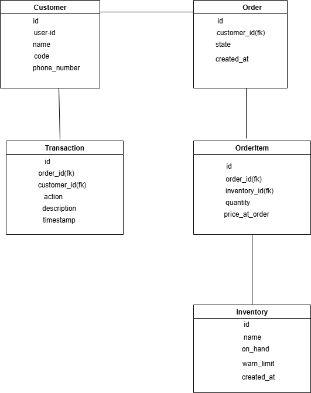

# Customer Orders – Backend Challenge Application

This is a **Django-based backend application** for managing customers, inventory, and orders.  
The system integrates **JWT authentication**, **OpenID Connect for login**, and **Africa’s Talking API** for sending SMS notifications.  
It also provides order tracking, inventory management, and audit logs for transactions.

## Features
- **JWT Authentication** for secure API access  
- **OpenID Connect** authentication for user login  
- **CRUD operations** for Customers, Inventory, and Orders  
- **Inventory Management**: Track stock levels (in-stock, low stock, out-of-stock)  
- **Order Management**: Create and approve orders, with transaction logs  
- **SMS Notifications** via Africa’s Talking API  
- **Signals** for automatic logging of order actions  
- **Unit Tests** with pytest & coverage  
- **CI/CD Ready** with GitHub Actions  

## ER Diagram
To understand the database schema, refer to the ER Diagram that illustrates the relationships between the models such as Customer, Order, Inventory, and TransactionLog.
The database schema consists of `Customer`, `Order`, `Inventory`, and `TransactionLog` models.  

---

## Requirements
- Python **3.10+**  
- Django **4.x**  
- Django REST Framework  
- SQLite (default) or PostgreSQL  
- Africa’s Talking API credentials  
- OpenID Connect credentials  

---

## Setup Instructions

1. **Clone the repository**
   git clone [git@github.com:smsharon/customerOrders.git](https://github.com/smsharon/customerOrders.git)
   cd customerOrders
2. **Create & activate a virtual environment:**
    python -m venv .venv
    source .venv/bin/activate   # On Linux/Mac
    .venv\Scripts\activate      # On Windows

3. **Install dependencies:**
   pip install -r requirements.txt

4. **Run migrations:**
    python manage.py migrate
6. **Run the Application**
    python manage.py runserver

## Running Tests
**Run all tests with coverage:**
    pytest --cov=orders
**Coverage report in terminal:**
    pytest --cov=orders --cov-report=term-missing

## API Endpoints
**Authentication**
  POST /api/login/ → Logs in a user with OpenID and returns JWT
**Customers**
  POST /api/customers/ → Add a new customer (protected)
  GET /api/customers/ → List all customers (protected)  
**Inventory**
  POST /api/inventory/ → Add new inventory item (protected)
  GET /api/inventory/ → List all items   
**Orders**
  POST /api/orders/ → Create an order & send SMS (protected)
  PUT /api/orders/{id}/approve/ → Approve an order (protected)
  GET /api/orders/ → Retrieve all orders for authenticated user

## License
This project is licensed under the MIT License.
